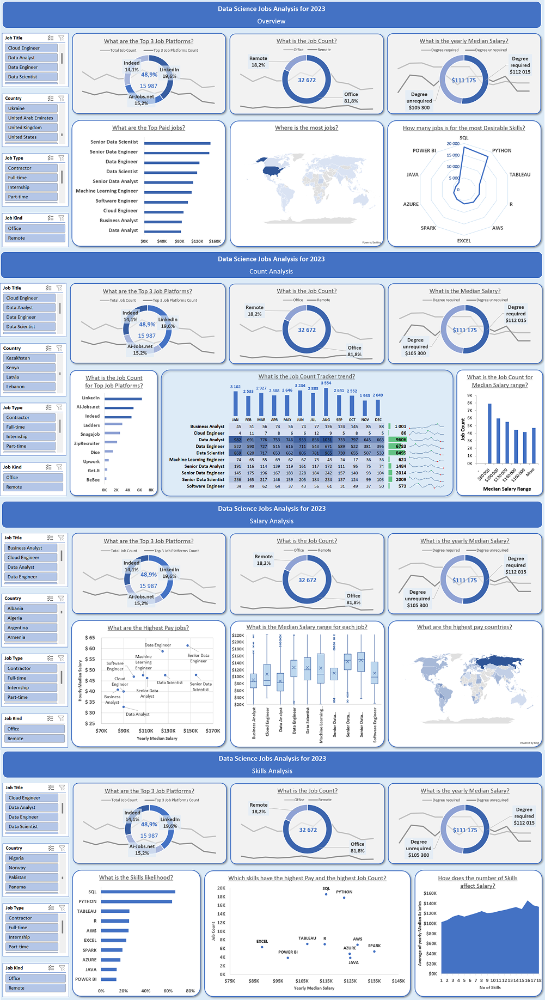
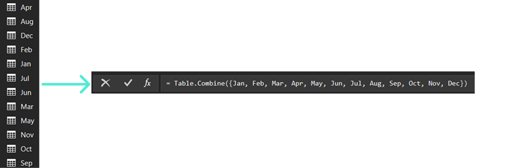
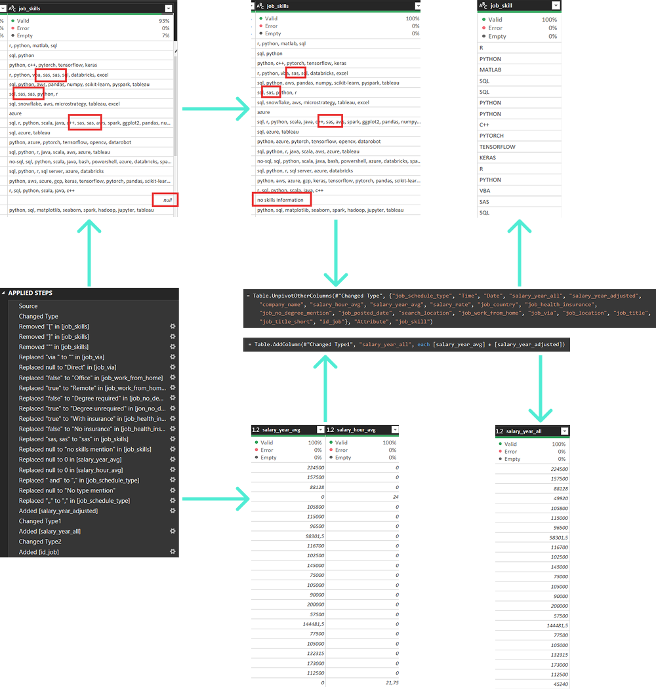
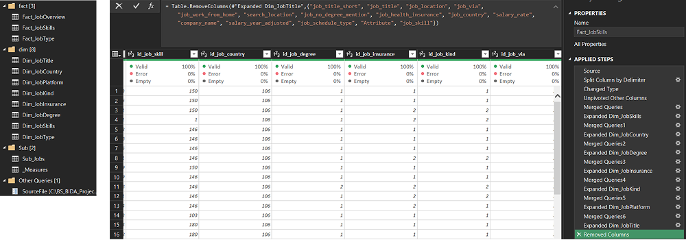
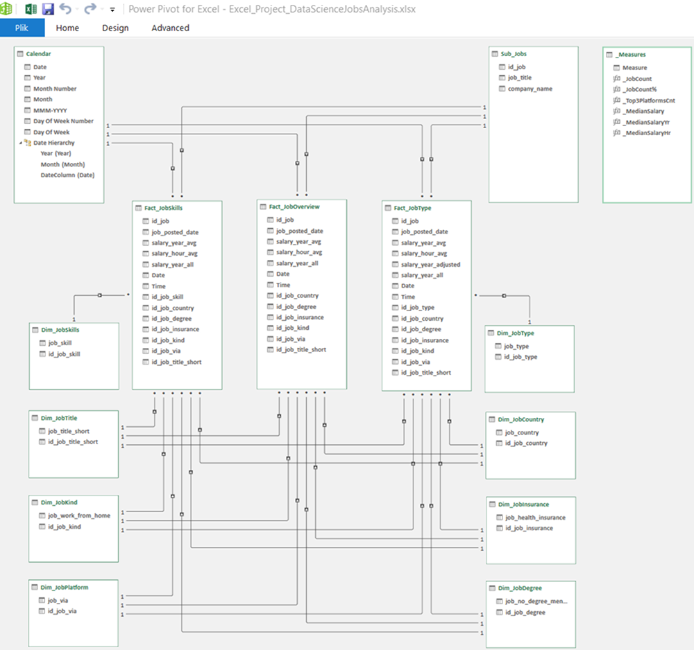
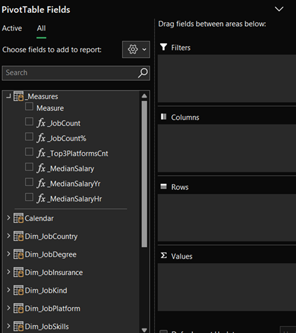
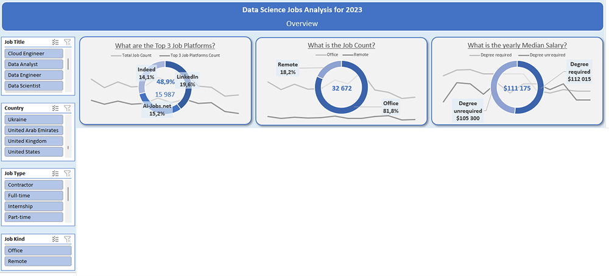

# Excel_DataScienceJobsAnalysis
The project demonstrates my Excel and analytical skills

  

## Introduction  
The project was created to investigate salaries for different Data Science jobs, along with desirable skills and degree of market demand.
The data is from the Excel Course titled "Excel for Data Analytics", createt by ***Luke Barousse*** and ***Kelly Adams***.

The project was carried out **entirely independently**  based on the acquired knowledge and skills, including those from the aforementioned course.

The data contains detailed information on job titles, salaries, locations, essential skills and others.  
The project taking into account 4 ranges:  
- **Overview**
- **Count Analysis**
- **Salary Analysis**
- **Skills Analysis**  

### Project Files  
  
All files (including **Final Protected xlsx** and **Editable xlsx**) are available for download on **GitHub**:  

[Excel_DataScienceJobsAnalysis](https://github.com/bartoszsmielowski/Excel_DataScienceJobsAnalysis)  

### Excel Skills used  
  
The following Excel skills were utilized for analysis:  
	- **Slicers**  
	- **diverse Charts**  & **Histogram** & **Sparklines**  
	- **Conditional Formatting**  
	- **nested Formulas** & **Functions**  
	- **Data Validation**  
	- **Pivot Tables**  
	- **Power Pivot** & **Relational Data Model**  
	- **Power Query**  
  
### Dataset  
  
The dataset used for this project contains real-world data science job information from 2023. It includes detailed information on:  
- **Job Titles**
- **Job Platforms**
- **Job Types**
- **Locations**
- **Skills**  

## ETL  
  
### Power Query  

Power Query was used as a tool to connect several datasets located in 12 different files.  All were combined into 1.  

The tool was also used to clean and transform the data.  
**Fact tables** and **Dimension tables** were created for the next step - **Relational Data Model** in **Star Schema**.  

### Sample operations  

  

  

  

## Power Pivot  

Relations between **Fact Tables** and **Dimention Tables** have been created in **Star Schema**:  

  

An additional, non related, blank table have been created and added to **Data Model** as a container for further **DAX measures**, to keep them organized at one place.  A few DAX measures have been created.  

  

## General concept of visualization  
  
A concept based on the need for visually pleasing clarity, without information overload, with an indication of key aspects, for easy and quick conclusions.  
  
In each of the 4 analysis ranges, a common parts were included:
	- **Connected Slicers**
	- **Extensive KPI cards**
The rest is individual for each analysis range.  

  

### Slicers  
  
Each **Slicer** has individualy created connections with **Pivot Tables**, per need.  
Connections with samle slicer:  

*//SlicerConnections//*  

### KPI cards  
  
Pivot Tables and DAX measures have been used.  
  
Each KPI card is created of 4 formatted parts to keep visual clarity along with getting additional information over raw value only:  
- **Background** for visual effect
- **Line Chart** to see participation of performance in time
- **TextBox** with **dynamic value**, got from **PivotTable**
- **Doughnut Chart** to show additional participation of the value
- **Insights gained:** Quick identification of key indicators along with information that Top 3 Job Platforms generate nearly half of all jobs, office work dominates over remote work and there is not much different in salary depends on having or not a degree. The most jobs is during the Summer months.

*//KPI build//*  

**NOTE  
Percentages can refer to the value filtered by the Slicers or to the total unfiltered value.  
In my case I wanted to get participation of Grand Total Values, what is done by using DAX measure in PivotTable:**  

*//ofGrandTotalValue//*  

*//KPI_PivotTables//*  

## Overview  build  
  
### Charts  
  
#### Top paid jobs - Bar Chart  

*//TopPayJobsSchema//*  

 - **Excel features:** Utilized bar chart feature (with formatted salary values) and optimized layout for clarity.
 - **Design choice:** Horizontal bar chart for visual comparison of median salaries.
 - **Data organization:** Sorted job titles by descending salary for improved readability. By creating 2 data series, the selected titles are formated to different bars color to stand out from the rest
 - **Insights gained:** Quick identification of salary trends - Seniors and Engineers are higher-paying then Analysts  

#### Location of Top Count jobs - Map Chart  

*//Map//*  

- **Excel features:** Utilized Excel's map chart feature to plot job count globally.  
- **Design choice:** Color-coded map to visually differentiate count levels across regions.  
- **Visual enhancement:** Improved readability and immediate understanding of geographic count trends.  

#### Desirable Skills - Radar Chart  

*//Radar//*  

- **Excel features:** Utilized Excel's radar chart feature to plot job count by the most desirable skills.
- **Design choice:** To visually differentiate count levels depend on skill.
- **Insights gained:** Quick identification of skills requirements - SQL and Python are the most common skills with the highest count of jobs

## Count Analysis build  
  
### Charts  
  
#### Top Job Platforms - Bar Chart  

*//TopPlatformsSchema//*  

- **Excel features:** Utilized bar chart feature (with formatted count values) and optimized layout for clarity.
- **Design choice:** Horizontal bar chart for visual comparison of job counts.
- **Data organization:** Sorted job platforms by descending count for improved readability. By creating 2 data series, the selected Top 3 Platforms are formated to different bars color to stand out from the rest.

#### Job Count Tracker - combination of dynamic table with Sparklines and Column Chart  

*//JobCountTracker//*  

- **Excel features:** Utilized features (with conditionaly formatted values) and optimized layout for clarity.
- **Design choice:** Table allaws to track job count by month for each job title individually and conditional formatting shows diversification. Vertical and horizontal summarization (colums and bars) for comparison of jobs by months and job titles. Sparklines to easly fallow changes in time.
- **Insights gained:** Summer months along with January have the most jobs while the end of year has much less jobs. Data Analyst, Data Engineer and Data Scientist are the Top 3 Job Titles

#### Median Salary Ranges - Histogram  

*//HistogramSchema//*  

- **Excel features:** Functions and formulas defined salary ranges. Utilized features optimized layout for clarity.
- **Design choice:** Histogram allows to reduce number of data for analysis and focus on defined ranges to give the general view of how many jobs can be found in each salary range.
- **Insights gained:** The higher salary the less jobs.

## Salary Analysis build  
  
### Charts  
  
#### Highest Pay Jobs - Scatter Chart  

*//ScatterYrHr//*  

- **Excel features:** Utilized features to compare jobs with different units of measure. Optimized layout for clarity.
- **Design choice:** Scatter Chart allows to provide comparison when analytic values have not the same unit of measure. It shows how each job title stands against the rest.
- **Insights gained:** Comparing jobs level it looks like Engineers are higher-paid over other positions. Comparing Yearly salary with hourly salary there are Top 4 job titles which outstanding: Senior Data Engineer, Senior Data Scientist, Data Engineer, Data Scientist

#### Median Salary Ranges - Box&Whisker Chart  

*//BoxWhisker//*  

- **Excel features:**  Utilized features to compare job titles and possibilities of each.
- **Design choice:** Detailed information, easy to read, about Median Salary for each job title. Provides information not only about MIN or MAX salary, but also includes AVG and Median of values.
- **Insights gained:** Machine Learning Engineer has the widest range of slary while the narrowest is for Senior Data Analyst. Salary for Senior Data Analyst is not much higer compared to Data Analyst

#### Highest Pay Countries - Map Chart  

*//TopPayCountries//*  

- **Excel features:** Utilized Excel's map chart feature to plot median salary globally.
- **Design choice:** Color-coded map to visually differentiate salary levels across regions.
- **Visual enhancement:** Improved readability and immediate understanding of geographic count trends.

## Skills Analysis build  
  
### Charts  
  
#### Skills Likelihood - Bar Chart  

*//SkillsLikelihood//*  

- **Excel features:** Utilized bar chart feature and optimized layout for clarity.
- **Design choice:** Horizontal bar chart for visual comparison of skills likelihood.
- **Data organization:** Sorted and filtered Top 10 Skills by descending likelihood for improved readability.
- **Data insights:** SQL and Python are the most common, even outstanding skills that are requested across all jobs  

#### Salary to Job Count comparison - Scatter Chart  

*//SkillsScatter//*  

- **Excel features:** Utilized feature and optimized layout for clarity.
- **Design choice:** Scatter Chart allows to provide comparison of job count along with salary position. It shows how each job title stands against the rest.
- **Data insights:** Jobs where SQL or Python are requested have the highest count of jobs and at the same time jobs are high-pay. Job Count where excel is requested is not outstanding, but at the same level as other top 7 skills, but jobs are less-pay.

#### Number of Skills to Salary - Area Chart  

*//SkillsAreaSchema//*  

- **Excel features:** Utilized feature (with formatted values) and optimized layout for clarity.
- **Design choice:** Area Chart allows to identify trend related to various increasing values.
- **Data insights:** The more skills required the higher-pay jobs.  
